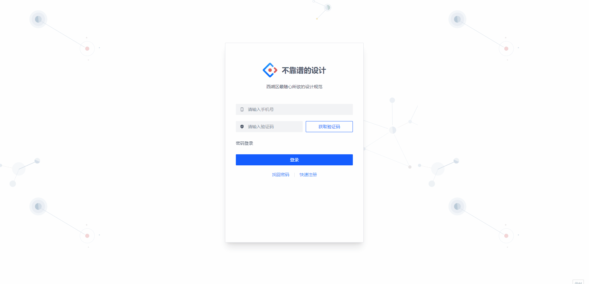
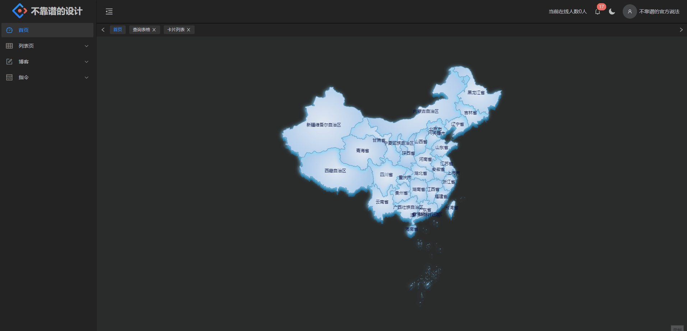
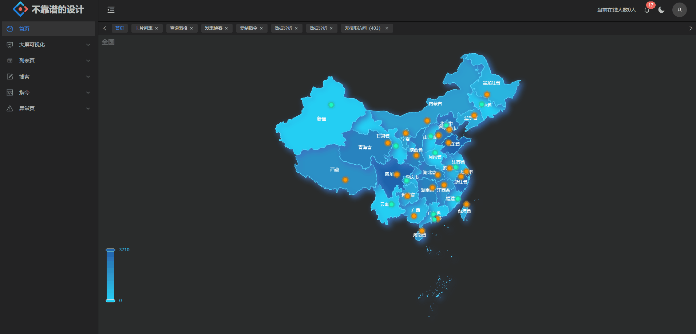

# 项目介绍

一个使用 Vue 3 + Typescript + Vite + Vue Router + Pinia + Arco Design + Windi CSS 的后台管理系统。因公司需要，创建项目频率较高，故在此封装一些最底层需要的依赖以避免重复工作，并在主干上不断完善一个后台管理系统

## 注意!!如使用该项目请将 src/assets/gif 文件夹删除,该部分只是用来展示效果

[预览地址](https://wyk1995.gitee.io/vue3_base)







## 功能依赖

- [x] Vue Router —— 路由管理
- [x] Pinia —— 状态管理
- [x] WindiCss —— css 样式
- [x] Axios —— api 请求
- [x] Arco Design —— 组件库

## 功能列表

- [x] 登录、注册、找回密码
- [x] 标签支持滚轮滚动
- [x] 首页地图支持下钻
- [x] 大屏可视化-->数据分析
- [x] 大屏可视化-->3D地图
- [x] 列表项-->查询表格（支持字段排序，自定义字段长度）
- [x] 列表项-->卡片表格
- [x] 博客-->发表博客（MarkDown编辑器）
- [x] 指令-->复制指令
- [x] 异常页-->403，404，500
- [x] 个人中心-->用户设置（支持头像裁剪）
- [ ] 菜单权限控制
...

## Project setup

```
npm install
```

### Compiles and hot-reloads for development

```
npm dev
```

### Compiles and minifies for production

```
npm build
```

## 支持

谁有比较好的axios封装教程，请留言，谢谢

<a href="https://github.com/little3201/leafage-ms/blob/master/LICENSE">
  <h2>MIT</h2>
</a>
